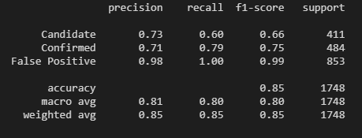
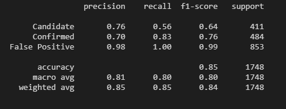
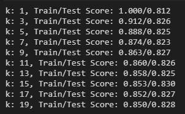
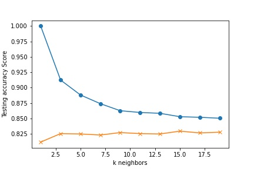

# Machine Learning Challenge
## Exoplanet Exploration Project

Over a period of nine years in deep space, the NASA Kepler space telescope has been out on a planet-hunting mission to discover hidden planets outside of our solar system.

Used Jupyter Notebook, Pandas, Matplotlib, and Numpy to predict each model to discover hidden planets outside of our solar system. 

## Process of the Work

1. Clean the Data. (Delete any null or empty values of the data.)
2. Preprocess the Data before fitting each model.
3. Perform feature selection and remove unnecessary features.
4. Use either `MinMaxScaler` or `StandardScaler` to scale the numerical data.
5. Separate the data into training and testing data.
6. Used `GridSearch` to tune model parameters.
7. Tune them and compare the two or more classifiers (`Candidate`, `Confirm`, `False Positive`)

## Reporting

### For All Models:

* Select all features to be tested.
* By unselecting one or more features in the data, it leads to losing accuracy for testing and training data and becomes lower because there are fewer values to be tested or to be trained.
### Logistic Regression Model

* This model is somewhat reliable because: 
1. R2 Score is 0.85695 
2. MSE is 0.165 
* Lower MSE tells us that this model has very few errors. 

* Precision, recall, and f1-score have high numbers, which are close to 1. 
* The number that is closer to the 1 has better accuracy of prediction.
* Just to be careful, False Positive has very idealistic values for precision, recall, and f1-score because they are very close to 1 or they reached 1. If the data is being too ideal, it will lead to some trouble predicting its data. 

### SVM Model

* Training Data Score: 0.8600038146099561
* Testing Data Score: 0.8478260869565217
* Test Acc: 0.848
* Best Score: 0.8579013819049768

* Although test accuracy is a number close to 1, some values in the classification report have lower numbers than the Logistic Regression Model. And, it is not a good model.

### KNN Model

* k=15 Test Acc: 0.830
* Best Score: 0.840547886391256
* Higher best score means better accuracy for testing and training the data.
* However, the accuracy of the testing score is no near k neighbors. 
* This means that the data is not accurate enough to tell the story. 
